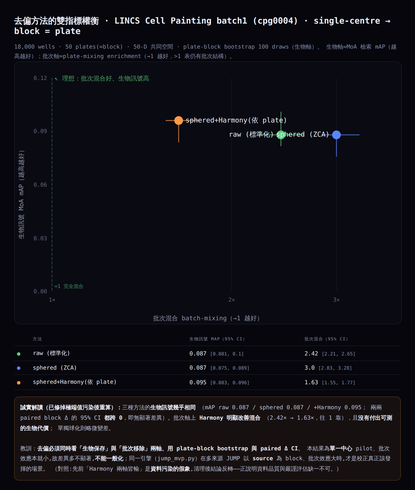

# MorphoProfile — Image-Based Morphological Profiling & MoA Retrieval

[English](README.md) · [繁體中文](README.zh-TW.md)

**Predict a compound's mechanism of action from what cells *look like* — no molecular structure required.**

An end-to-end, reproducible pipeline on open [Cell Painting](https://doi.org/10.1038/nprot.2016.105)
data: raw 5-channel microscopy images → segmentation → morphological fingerprints → nearest-neighbour
MoA retrieval, plus a rigorously evaluated batch-correction comparison.

Everything is computed offline from public data by the scripts in this repo, then embedded in a
single self-contained `index.html`. **No fabricated or placeholder numbers.**



---

## What this is

Most drug-discovery ML competes on *molecule → property* prediction — a crowded benchmark space.
This project takes the other input: **the image**. It builds morphological fingerprints from cell
images and uses **representation learning + retrieval** to infer mechanism, which is a far less
crowded niche for an individual developer and uses computer-vision skills directly.

The work is split into three layers, and the README is honest about what each one proves.

| Layer | What it does | Scale |
|---|---|---|
| **1. Image → fingerprint** (`images/`) | Real 5-channel images → my own nucleus segmentation → 59 morphological features → z-score vs DMSO | 9 compounds, 701 single cells |
| **2. Profile analysis** (`pipeline.py`) | Pre-computed CellProfiler profiles → cleaning → consensus → UMAP, MoA retrieval, candidate-activity screen, de-biasing comparison | 19,200 wells, 561 compounds, 587 features |
| **3. Rigorous evaluation** (`mvp/`) | Does batch correction actually help? Dual metrics + plate-block bootstrap + paired ΔCI | LINCS (50 plates) and real JUMP-Target (16 plates, 4,102 wells) |

Layer 2 uses profiles rather than pixels because that is the field's standard division of labour —
the Broad Institute already ran CellProfiler across all of JUMP and published the outputs. Downloading
the ~127 TB of raw JUMP images is neither necessary nor advisable. Layer 1 exists so the project can
still demonstrate the image-processing half end to end.

---

## Highlights

### Image pipeline recovers known biology

Using **my own 59 features** (not the official CellProfiler profiles), on real CPJUMP1 images:

| Compound | Mechanism | Median nucleus area | vs DMSO | Cell count |
|---|---|---|---|---|
| DMSO | control | 934 | — | 95 |
| **AMG900** | Aurora kinase inhibitor | **1389** | **+49 %** | 38 (40 %) |
| **FK-866** | NAMPT inhibitor | **451** | **−52 %** | 36 (38 %) |
| quinidine | ion-channel blocker | 928 | ≈ 0 % | 94 (99 %) |

The two strongest phenotypes move nuclear size in **opposite directions**, each consistent with its
known mechanism (Aurora inhibition → failed cytokinesis → polyploid nuclei; NAD⁺ depletion →
apoptotic chromatin condensation), while the weak-phenotype control barely moves.

The fingerprint is also **not merely a cell-death proxy**: phenotype strength correlates only
moderately with density change (Pearson r = +0.63, p = 0.09, n = 8), and dexamethasone ranks 3rd
while losing few cells — its signature is dominated by a **specific drop in mitochondrial signal**
(Cohen's d = −4.09), consistent with glucocorticoid-receptor action on mitochondria.

### MoA retrieval on 561 compounds

Nearest-neighbour retrieval over standardized consensus profiles:
**Top-1 = 9.0 %**, **Top-5 recall = 14.9 %**, versus a self-excluded random baseline of **0.71 %**
(**≈ 12.7× chance**, n = 377 evaluable compounds).

Modest but clearly above chance — and honest about it. That gap is exactly the motivation for better
representations and validated batch correction.

### Batch correction: measured, not assumed

Correction is evaluated on **two axes simultaneously** (you can trivially win one by wrecking the
other), in a common 50-D space, with a **plate-block bootstrap** and **paired** Δ confidence intervals.

Real JUMP-Target result (`mvp/jump_mvp_results.json`, 4,102 wells, block = plate):

| Representation | Biology (MoA mAP, 95 % CI) | Batch mixing (→1 is better) |
|---|---|---|
| raw | 0.154 [0.132, 0.213] | 3.17 [2.30, 3.19] |
| sphered (ZCA) | 0.180 [0.114, 0.240] | 1.88 [1.66, 1.87] |
| sphered + Harmony | 0.131 [0.107, 0.219] | **1.04 [1.01, 1.11]** |

Correction clearly removes batch structure on JUMP (3.17 → 1.04, essentially fully mixed) with **no
measurable biology cost** — every paired Δ CI crosses zero. On the single-centre LINCS pilot the same
engine shows much weaker effects, as expected. Neither result is over-claimed as significant.

> A note on scientific integrity: an earlier version of this project reported the *opposite*
> conclusion about batch correction. That was traced to a data-quality bug — a winsorization step was
> used to select feature names but never written back to the analysis matrix, letting ~176 near-zero-MAD
> features with values up to 1e19 dominate every distance. After the fix, the conclusion reversed.
> The fix, the invalidation mechanism, and the corrected numbers are all in the repo.

---

## Quick start

```bash
git clone https://github.com/USERNAME/morphoprofile.git
cd morphoprofile

# environment (either one)
conda env create -f environment.yml && conda activate morpho
# or: pip install -r requirements.txt

# (optional) image layer — needs the upstream image repo, ~200 MB
git clone https://github.com/jump-cellpainting/2021_Chandrasekaran_submitted
python images/image_pipeline.py 2021_Chandrasekaran_submitted

# main analysis + page  (downloads ~50 MB of LINCS profiles on first run, cached in data/)
python pipeline.py
python build_page.py            # -> index.html
python test_consistency.py      # asserts the page's tables and headline metrics agree
```

Then open `index.html` in a browser. No server, no build step, no external requests at runtime.

**Note on the image data:** the TIFFs in `example_images/` come down with a normal `git clone` —
only `.gz` files in that repository use Git LFS.

### Deploying

`index.html` is fully self-contained (all CSS, JS, data and images inlined as base64), so any static
host works. On **Vercel**: import the repository and deploy — the root `index.html` is served
automatically, no framework preset or configuration needed.

---

## Repository layout

```
index.html                  Self-contained interactive app (generated — do not edit by hand)
index_template.html         Template with __DATA__ / __IMGDATA__ placeholders (edit this)
build_page.py               Injects results into the template -> index.html

pipeline.py                 Single source of truth for the profile analysis
test_consistency.py         Verifies neighbour tables == headline metrics
run_on_JUMP.py              Points the profile pipeline at full JUMP cpg0016 (S3, anonymous)

images/
  image_pipeline.py         Images -> segmentation -> 59 features -> fingerprints
  out/webimages.json        Channel images, segmentation overlays, fingerprints (generated)
  out/per_cell_features.csv 701 cells x 59 features (generated, inspectable)

mvp/
  rigorous_eval.py          Dual-metric evaluation engine + plate-block bootstrap
  jump_mvp.py               Same engine on real JUMP-Target (CPJUMP1)
  make_tradeoff.py          Renders the trade-off figure
  mvp_results.json          LINCS results
  jump_mvp_results.json     Real JUMP-Target results
  README_MVP.md             Method notes and limitations

demo/                       Two images for demoing the in-browser upload feature
web/webdata.json            Computed results for the main page (generated)
CITATION.md                 Full data sources and citations
```

---

## Method notes

**Feature sanitization (`pipeline.py`).** Non-finite values → NaN; features whose max |value| exceeds
100 are dropped as MAD-blowup artifacts; the rest are winsorized to ±15 **and written back**; then
variance and correlation filtering. Downstream code reads only the sanitized matrix, and
`data/manifest.json` records the commit, cleaning rules and a version tag so a stale cache cannot be
silently reused.

**Metrics.** Retrieval uses cosine similarity on standardized per-compound consensus profiles. The
random baseline **excludes the query itself** and is matched to eligible-query class sizes:
`mean_i (size(MoA_i) − 1) / (P − 1)`. The neighbour tables shown in the app and the headline metrics
are produced by the *same* computation — `test_consistency.py` asserts a third party can recompute
one from the other exactly.

**Candidate activity.** A heuristic screen (consensus L2 distance from the DMSO centroid exceeding the
95th percentile of a DMSO-only null), deliberately labelled *candidate active* rather than
*significant* — there is no plate-matched null, no whitening, and no per-compound FDR. The rigorous
upgrade is replicate mAP with permutation p-values and FDR.

**Channel mapping.** `ch5 = DNA` and `ch1 = Mito` were determined empirically (nuclear morphology and
segmentation for DNA; strongest nuclear exclusion and absent nucleolar contrast for Mito). `ch2/3/4 =
AGP/RNA/ER` are inferred from those anchors by acquisition wavelength order and are **not** confirmed
against the authoritative table, which lives in the LFS-tracked `load_data_csv/*.csv.gz`. Verify with:

```bash
git lfs pull --include="load_data_csv/2020_11_04_CPJUMP1/BR00117010/load_data.csv.gz"
```

---

## Limitations

- **One field per compound, no experimental replicates** in the image layer — the mechanism table is
  illustrative case evidence, not a statistical result.
- **59 hand-built features** are a simplified re-implementation of CellProfiler (1,747 features),
  intended to demonstrate the end-to-end capability, not to replace it.
- The in-browser upload feature runs a **simplified analysis** (single grayscale channel, Otsu,
  connected components, three summary statistics) — it is not the 59-D Python fingerprint.
- LINCS is **single-centre**, so its batch effects are small by construction; results there should not
  be generalized to multi-source JUMP.
- Moving to full JUMP `cpg0016` is **not** a URL swap: each subset is pre-processed differently
  (compound = feature-select + Harmony; CRISPR = sphering + Harmony + PCA; ORF = sphering + Harmony),
  and all-pairs cosine over ~116k compounds is a >100 GB dense matrix — use FAISS or chunked top-k.
- mAP is currently query-weighted; macro-averaged-per-MoA should be reported alongside it.

## Roadmap

1. Replace the heuristic activity screen with replicate mAP + permutation p-values + FDR.
2. Extend the image layer beyond one field per compound so statistics become possible.
3. Self-supervised image embeddings (DINO-style) to replace hand-built features — needs GPU and far
   more images than the 9 fields used here.
4. Scale retrieval to full JUMP `cpg0016` with FAISS / chunked top-k.
5. An LLM layer that *explains retrieved evidence only* — never asserts an unretrieved mechanism.

---

## License & attribution

Source code is **MIT** licensed (see [LICENSE](LICENSE)).

Redistributed scientific data — the microscopy images in `demo/`, the images embedded in
`index.html`, and the derived feature tables — originates from the Broad Institute and the
JUMP-Cell Painting Consortium, whose upstream repositories dual-license **data, results and figures
under CC0 1.0**. That data remains CC0 here.

**Please cite the upstream datasets.** Full details in **[CITATION.md](CITATION.md)**; the primary ones are:

- Chandrasekaran, S. N. et al. (2024). *Three million images and morphological profiles of cells
  treated with matched chemical and genetic perturbations.* **Nature Methods** 21, 1114–1121.
  https://doi.org/10.1038/s41592-024-02241-6
- Natoli, T. et al. (2021). *broadinstitute/lincs-cell-painting: Full release of LINCS Cell Painting
  dataset.* Zenodo. https://doi.org/10.5281/zenodo.5008187
- Weisbart, E. et al. (2024). *Cell Painting Gallery: an open resource for image-based profiling.*
  **Nature Methods** 21, 1775–1778. https://doi.org/10.1038/s41592-024-02399-z
- Bray, M.-A. et al. (2016). *Cell Painting, a high-content image-based assay for morphological
  profiling.* **Nature Protocols** 11, 1757–1774. https://doi.org/10.1038/nprot.2016.105

Data access is free and requires no AWS account:
`aws s3 ls --no-sign-request s3://cellpainting-gallery/`
