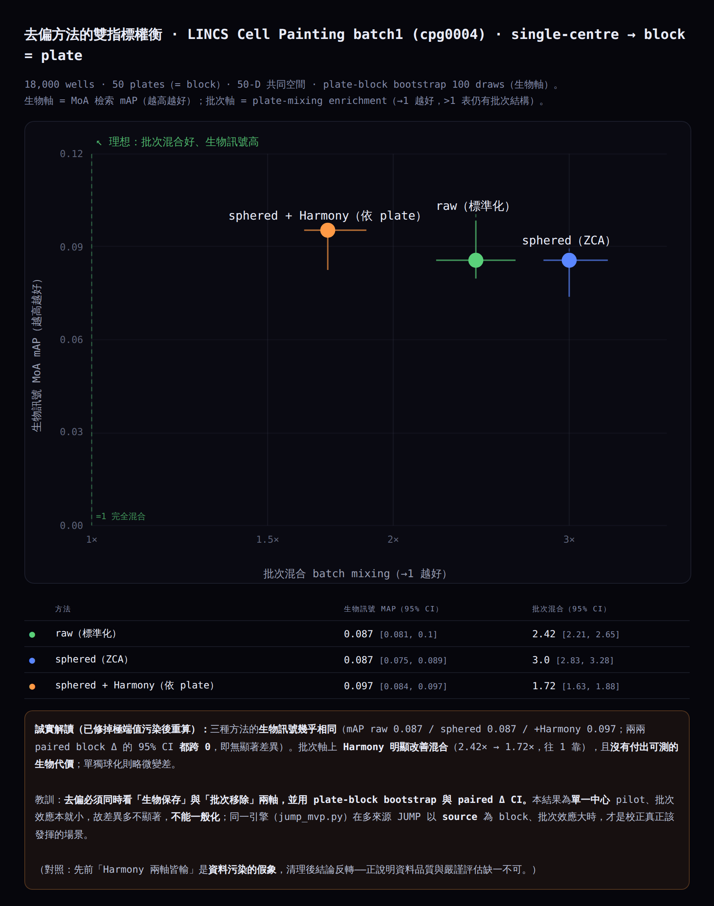

# MorphoProfile — 細胞影像形態分析與作用機制檢索

[English](README.md) · [繁體中文](README.zh-TW.md)

**不需要分子式,看細胞長什麼樣就推測藥物的作用機制(MoA)。**

一條在開源 [Cell Painting](https://doi.org/10.1038/nprot.2016.105) 資料上端到端、可重現的管線:
原始五通道顯微影像 → 細胞核分割 → 形態指紋 → 最近鄰 MoA 檢索,另附一套經嚴謹驗證的批次校正比較。

所有數字都由本 repo 的程式從公開資料**離線計算**,再嵌入單一自足的 `index.html`。**沒有任何虛構或示意數據。**



---

## 這是什麼

多數藥物開發 ML 都在拚「分子 → 性質」預測,那是過度 benchmark 的紅海。本專案改用另一種輸入:**影像**。
從細胞影像建立形態指紋,再用**表徵學習 + 檢索**推測機制——這個切入點 solo 開發者少、且能直接發揮電腦視覺技能。

作品分三層,每一層各自證明什麼、不證明什麼,README 都誠實交代。

| 層 | 做什麼 | 規模 | 證據等級 |
|---|---|---|---|
| **1. 影像 → 指紋**(`images/`) | 真實五通道影像 → 自建細胞核分割 → 59 個形態特徵 → 對 DMSO 標準化 | 9 個化合物、701 顆細胞 | **案例展示** — 證明管線可運作、生物學說得通;**非**統計驗證 |
| **2. Profile 分析**(`pipeline.py`) | 已算好的 CellProfiler profiles → 清理 → 共識指紋 → UMAP、MoA 檢索、候選活性篩選 | 19,200 wells、561 化合物、587 特徵 | **主要量化結果** — 可重現、第三方可驗證 |
| **3. 去偏評估**(`mvp/`) | 雙指標 + plate-block bootstrap + 配對 ΔCI | LINCS(50 盤);JUMP-Target(16 盤、4,102 wells) | LINCS:輔助性量化。JUMP:**探索性** — plate 與條件混雜(見下) |

刻意把這件事講清楚:並不是每一區都是正式驗證,而**願意明講哪些是、哪些不是**,才是可信分析與包裝過的 demo 的差別。

第 2 層用 profiles 而非像素,是因為這是本領域的**標準分工**——Broad 研究所已為整個 JUMP 跑完 CellProfiler
並公開結果,下載約 127 TB 原始影像既不必要也不明智。第 1 層的存在,是為了讓作品仍能完整展示影像處理的那一半。

---

## 重點成果

### 影像管線重現了已知生物學

用**我自己的 59 個特徵**(不是官方 CellProfiler profile),在真實 CPJUMP1 影像上:

| 化合物 | 機制 | 核面積中位數 | vs DMSO | 細胞數 |
|---|---|---|---|---|
| DMSO | 對照 | 934 | — | 95 |
| **AMG900** | Aurora 激酶抑制劑 | **1389** | **+49 %** | 38(40 %) |
| **FK-866** | NAMPT 抑制劑 | **451** | **−52 %** | 36(38 %) |
| quinidine | 離子通道阻斷劑 | 928 | ≈ 0 % | 94(99 %) |

兩個最強表型的核大小變化**方向相反**,且各自符合已知機制(Aurora 抑制 → 胞質分裂失敗 → 多倍體巨核;
NAD⁺ 耗竭 → 凋亡染色質濃縮),而弱表型的對照藥幾乎不動。另一個提示性的觀察:指紋似乎也不純粹是
「死了多少細胞」——dexamethasone 細胞損失很少卻排第 3,其特徵由粒線體訊號下降主導,
與醣皮質素受體作用於粒線體的文獻一致。

> **本層的定位:**這是一個**案例式的端到端展示**,每個化合物只有**一個 field**。
> 它證明的是**管線能運作、且生物學上說得通**——**不是統計驗證,也不宣稱可泛化**。
> 其中的「細胞」是同一個 field 內的觀測值,不是獨立的實驗重複,因此不做也不隱含任何顯著性檢定。

### 561 個化合物的 MoA 檢索

在標準化共識指紋上做最近鄰檢索:
**Top-1 = 9.0 %**、**Top-5 召回 = 14.9 %**,對照**排除自身**的隨機基準 **0.71 %**
(**約 12.7 倍於隨機**,n = 377 個可評估化合物)。

數字不高但明顯優於隨機——而且誠實呈現。這個落差正是「需要更強表徵與經驗證的批次校正」的動機。

### 批次校正:用量的,不是用猜的

校正在**兩個軸同時**評估(只顧一軸很容易靠犧牲另一軸「贏」),在共同的 50 維空間中進行,
並用 **plate-block bootstrap** 與**配對** Δ 信賴區間。

**探索性**的 JUMP-Target 結果(`mvp/jump_mvp_results.json`,16 盤、4,102 個處理孔)。

CPJUMP1 的 **16 個 compound plate 每一盤都只含單一細胞株與單一時間點**(已在 metadata 驗證),
plate 完全巢狀於 `cell_line × timepoint`。因此對 plate 做校正,在數學上無法與「移除 U2OS vs A549、
24h vs 48h 的真實差異」區分;而 *pooled* 的 MoA 檢索正是跨這些條件彙總,偵測不到這個損失。

合併分析(混雜,僅供對照):

| 表徵 | 生物訊號(MoA mAP,95 % CI) | 批次混合(越接近 1 越好) |
|---|---|---|
| raw | 0.154 [0.132, 0.213] | 3.17 [2.30, 3.19] |
| sphered(ZCA) | 0.180 [0.114, 0.240] | 1.88 [1.66, 1.87] |
| sphered + Harmony | 0.131 [0.107, 0.219] | 1.04 [1.01, 1.11] |

> **Harmony 改善了 plate 混合,而 pooled 的 MoA 檢索沒有測到損失。但因為在 CPJUMP1 中 plate 與
> cell line、timepoint 混雜,這個結果無法區分「移除技術變異」與「移除條件特異的生物訊號」。**

**條件訊號保留度**正是用來量化這件事(同一組 embedding 上的 kNN 同標籤富集度;1.0 代表該差異已消失):

| 表徵 | 細胞株 | 時間點 |
|---|---|---|
| raw | 1.62 | 1.28 |
| sphered(ZCA) | 1.21 | 1.10 |
| sphered + Harmony | 1.11 | **1.02** |

Harmony 近乎完美的批次混合(3.17 → 1.04),伴隨的是時間點訊號**幾乎被完全抹平**(1.28 → 1.02),
細胞株訊號的超額富集也砍掉一半以上(1.62 → 1.11)。**那份「批次移除」的成績,有相當部分是用真生物換來的。**

**分層評估**——在每個 `cell_line × timepoint` 分層內各自評估,此時 plate 才是真正的技術重複
(每層 4 盤、約 1,000 wells、260 化合物、26 個合格 MoA 查詢):

| 分層 | raw mAP | Δ sphered(95 % CI) | Δ sphered+Harmony(95 % CI) | raw 批次混合 |
|---|---|---|---|---|
| A549-24h | 0.159 | −0.027 [−0.123, +0.062] | −0.051 [−0.131, +0.068] | 1.46 |
| A549-48h | 0.187 | +0.006 [−0.046, +0.035] | 0.000 [−0.047, +0.047] | 1.11 |
| U2OS-24h | 0.154 | −0.011 [−0.045, +0.043] | −0.005 [−0.072, +0.075] | 1.19 |
| U2OS-48h | 0.166 | +0.001 [−0.042, +0.093] | +0.002 [−0.041, +0.082] | 1.59 |

由此得到兩個結論。其一,**條件內的批次效應其實不大**:raw 批次混合只有 1.11–1.59,而非合併時的 3.17
——合併分析中看到的「巨大批次效應」,主要是被混雜進去的生物條件。這符合 CPJUMP1 是**單一 source、
單一 site** pilot 的預期。其二,**八個 Δ 的 95% CI 全部跨過 0**:在這個設計與樣本量下
(每層 26 個合格查詢,合計 104 個),兩種校正方法都測不到生物效益,也測不到明確損害。
CI 偏寬,**不足以排除中等幅度的效應**——「在此測不到」不等於「無效」。

`mvp/jump_mvp.py` 會自動完成上述三步:偵測並揭露巢狀結構、跑條件訊號保留診斷、再做分層評估,
並在結果 JSON 中寫入 `"status": "exploratory"` 與明確的 `caveat` 欄位。

> **關於科學誠信的說明**:本專案早期版本對批次校正得出的是**相反**結論。追查後發現是資料品質 bug——
> winsorize 只被用來挑選特徵名稱、卻**沒有寫回分析矩陣**,導致約 176 個近零-MAD、數值高達 1e19 的
> 特徵主導了所有距離計算。修正後結論反轉。修正方式、快取失效機制與更正後的數字都保留在 repo 中。

---

## 快速開始

```bash
git clone https://github.com/WayneChou-bot/AI_cytoprint.git
cd AI_cytoprint

# 建立環境(擇一)
conda env create -f environment.yml && conda activate morpho
# 或:pip install -r requirements.txt

#(可選)影像層 — 需要上游影像 repo,約 200 MB
git clone https://github.com/jump-cellpainting/2021_Chandrasekaran_submitted
python images/image_pipeline.py 2021_Chandrasekaran_submitted

# 主分析 + 網頁(首次執行會下載約 50 MB LINCS profiles,快取於 data/)
python pipeline.py
python build_page.py            # -> index.html
python test_consistency.py      # 驗證頁面表格與頭條指標一致
```

接著用瀏覽器打開 `index.html`。不需伺服器、不需 build、執行時不對外連線。

**影像資料補充**:`example_images/` 裡的 TIFF 一般 `git clone` 就會下載——該 repo 只有 `.gz` 走 Git LFS。

### 佈署

`index.html` 完全自足(CSS、JS、資料、影像全部內嵌為 base64),任何靜態主機都能用。
用 **Vercel** 的話:匯入 repo 直接部署即可,根目錄的 `index.html` 會自動被 serve,不需要選框架或任何設定。

---

## 檔案結構

```
index.html                  自足的互動網頁(自動產生,請勿手改)
index_template.html         含 __DATA__ / __IMGDATA__ 佔位符的模板(要改改這個)
build_page.py               把結果注入模板 -> index.html

pipeline.py                 profile 分析的唯一計算來源
test_consistency.py         驗證鄰居表 == 頭條指標
run_on_JUMP.py              把 profile 管線指向完整 JUMP cpg0016(S3 匿名存取)

images/
  image_pipeline.py         影像 -> 分割 -> 59 特徵 -> 指紋
  out/webimages.json        通道圖、分割疊圖、指紋(自動產生)
  out/per_cell_features.csv 701 顆細胞 × 59 特徵(自動產生,可自行檢查)

mvp/
  rigorous_eval.py          雙指標評估引擎 + plate-block bootstrap
  jump_mvp.py               同引擎跑真實 JUMP-Target(CPJUMP1)
  make_tradeoff.py          產生權衡圖
  mvp_results.json          LINCS 結果
  jump_mvp_results.json     真實 JUMP-Target 結果
  README_MVP.md             方法說明與限制

demo/                       示範瀏覽器上傳功能用的兩張影像
web/webdata.json            主頁面的計算結果(自動產生)
CITATION.md                 完整資料來源與引用
```

---

## 方法說明

**特徵清理(`pipeline.py`)**:非有限值 → NaN;max |值| 超過 100 的特徵視為 MAD 爆掉的假象並丟棄;
其餘 winsorize 到 ±15 **並寫回**;之後才做變異數與相關性過濾。下游只讀這份清理過的矩陣,
且 `data/manifest.json` 記錄 commit、清理規則與版本標記,避免舊快取被無聲重用。

**指標**:檢索使用標準化的每化合物共識指紋上的餘弦相似度。隨機基準**排除查詢自身**,
並依合格查詢的類別大小計算:`mean_i (size(MoA_i) − 1) / (P − 1)`。網頁上的鄰居表與頭條指標
由**同一套計算**產生——`test_consistency.py` 會斷言第三方能從其中一個精確重算出另一個。

**候選活性**:啟發式篩選(共識到 DMSO 中心的 L2 距離超過 DMSO-only 虛無分布第 95 百分位),
刻意標示為**候選活性**而非**顯著**——因為沒有 plate-matched null、沒有白化、也沒有 per-compound FDR。
嚴謹版應改用 replicate mAP 搭配 permutation p-value 與 FDR。

**通道對應**:`ch5 = DNA` 與 `ch1 = Mito` 為實證判定(DNA 依核形態與分割確認;Mito 依核內排除性最高、
且核仁對比最低確認)。`ch2/3/4 = AGP/RNA/ER` 是由上述兩端錨定、依取像波長順序**推定**,
**未**與權威對照表核對——權威表在走 LFS 的 `load_data_csv/*.csv.gz`。驗證方式:

```bash
git lfs pull --include="load_data_csv/2020_11_04_CPJUMP1/BR00117010/load_data.csv.gz"
```

---

## 限制

- 影像層**每個化合物只有 1 個 field、無實驗重複**——機制表是對已知化合物的 sanity check,不是統計結果。
  同一 field 內的細胞不是獨立重複;也未證明表型強度獨立於細胞密度或細胞死亡。
- **JUMP-Target 比較為探索性**:CPJUMP1 中 plate 與 `cell_line × timepoint` 完全混雜,
  pooled 結果無法區分技術變異與條件特異的生物訊號,應改看分層輸出。
- **59 個自建特徵**是 CellProfiler(1,747 特徵)的簡化重製版,目的在展示端到端能力,不是取代它。
- 瀏覽器上傳功能執行的是**簡化分析**(單通道灰階、Otsu、連通元件、三個統計量),不等於 Python 的 59 維指紋。
- LINCS 是**單一中心**資料,批次效應本來就小,其結果不應一般化到多來源的 JUMP。
- 換到完整 JUMP `cpg0016` **不是換個網址就好**:各 subset 前處理不同
  (compound = 特徵選擇 + Harmony;CRISPR = sphering + Harmony + PCA;ORF = sphering + Harmony),
  且對約 11.6 萬個化合物做 all-pairs 餘弦是超過 100 GB 的稠密矩陣——必須改用 FAISS 或分塊 top-k。
- 目前 mAP 為 query 等權,應同時報告 macro-averaged-per-MoA。

## 後續規劃

1. 把啟發式活性篩選換成 replicate mAP + permutation p-value + FDR。
2. 影像層擴充到每化合物多個 field,才有統計可言。
3. 自監督影像 embedding(DINO 類)取代手工特徵——需要 GPU,且影像量要遠多於目前的 9 個 field。
4. 用 FAISS / 分塊 top-k 把檢索擴到完整 JUMP `cpg0016`。
5. 加上 LLM 層,但**只解說已檢索到的證據**,絕不宣稱未經檢索的機制。

---

## 授權與出處

程式碼採 **MIT** 授權(見 [LICENSE](LICENSE))。

重新散布的科學資料——`demo/` 內的顯微影像、`index.html` 內嵌的影像,以及衍生的特徵表——
來自 Broad Institute 與 JUMP-Cell Painting Consortium,其上游 repo 對**資料、結果與圖採 CC0 1.0
雙授權**,因此這些資料在本專案中同樣維持 CC0。

**請引用上游資料集。** 完整內容見 **[CITATION.md](CITATION.md)**,主要幾筆:

- Chandrasekaran, S. N. et al. (2024). *Three million images and morphological profiles of cells
  treated with matched chemical and genetic perturbations.* **Nature Methods** 21, 1114–1121.
  https://doi.org/10.1038/s41592-024-02241-6
- Natoli, T. et al. (2021). *broadinstitute/lincs-cell-painting: Full release of LINCS Cell Painting
  dataset.* Zenodo. https://doi.org/10.5281/zenodo.5008187
- Weisbart, E. et al. (2024). *Cell Painting Gallery: an open resource for image-based profiling.*
  **Nature Methods** 21, 1775–1778. https://doi.org/10.1038/s41592-024-02399-z
- Bray, M.-A. et al. (2016). *Cell Painting, a high-content image-based assay for morphological
  profiling.* **Nature Protocols** 11, 1757–1774. https://doi.org/10.1038/nprot.2016.105

資料存取免費、且不需要 AWS 帳號:
`aws s3 ls --no-sign-request s3://cellpainting-gallery/`
